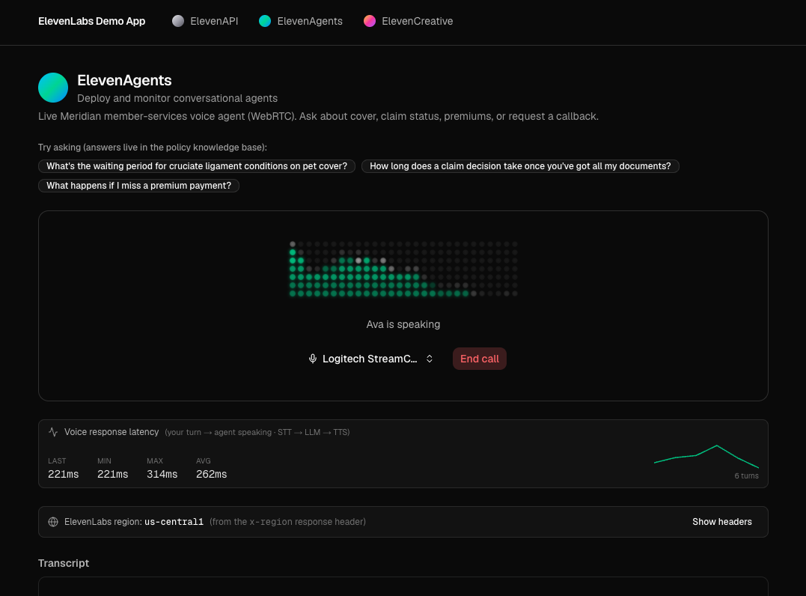
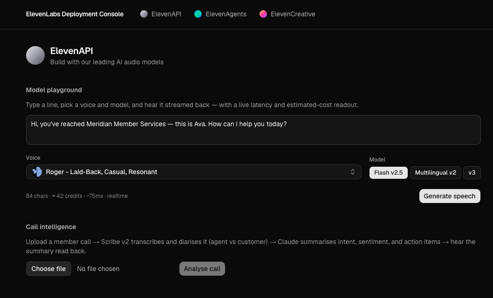
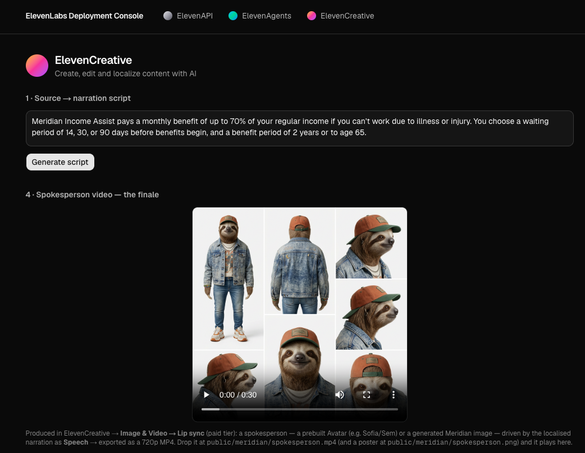

# ElevenLabs Demo App

> One Next.js app, three ElevenLabs product pillars — **ElevenAPI**, **ElevenAgents**, and **ElevenCreative** — threaded through a single, believable customer scenario and ending on a lip-synced spokesperson video.

A reference implementation that takes a fictional mid-market member-services business (**"Meridian"**) and walks its member journey across the ElevenLabs platform: raw models → a live voice agent → localized content → a generated video. It shows how the platform composes — realtime, batch, content, and visual — within one app.

Built with **Next.js 16 (App Router) · React 19 · TypeScript · Tailwind v4 · shadcn/ui** and the official [`ui.elevenlabs.io`](https://ui.elevenlabs.io) components.

---

## Screenshots

### ElevenAgents — the conversation _(centerpiece)_
A live in-browser **WebRTC** voice agent grounded in Meridian's policy docs (RAG), with client tools, a Matrix audio visualizer, mic selection, and a live chat transcript. A **voice response-latency meter** (running min/max/avg + sparkline) and the **serving region** are surfaced live for the performance and residency story.



### ElevenAPI — the building blocks
A TTS model playground (voice picker + Flash / Multilingual / v3, with a live latency & cost readout) and Call Intelligence: Scribe v2 diarised transcription → Claude summary → TTS read-back.



### ElevenCreative — the content engine → video finale
A policy excerpt → Claude narration script → expressive TTS v3 narration (A/B vs Multilingual v2) → dubbing into five languages → a Studio-produced lip-synced spokesperson video.



---

## What it demonstrates

| Pillar | Capabilities |
| :--- | :--- |
| **ElevenAPI** | Streaming TTS (Flash v2.5 / Multilingual v2 / v3) · Scribe v2 STT with diarization & agent/customer roles · voice library · latency/cost readout |
| **ElevenAgents** | Realtime WebRTC voice agent · knowledge base + RAG · client tools · turn-taking & barge-in · server-minted conversation tokens · live voice-latency meter |
| **ElevenCreative** | TTS v3 expressive narration · Dubbing into 5 languages (incl. Japanese) · lip-synced spokesperson video (Studio) |

The non-ElevenLabs LLM passes (call summary, narration script) use **Anthropic Claude**.

### Observability — region & latency

- **Serving region.** Every ElevenLabs-backed request surfaces the `x-region` response header in the UI, with a one-click reveal of the full header set for debugging — making the residency story visible rather than asserted.
- **Voice response latency.** The Agents page measures, per turn, the time from the member's transcribed speech to the agent starting to speak (the real STT → LLM → TTS round-trip), shown as a running last / min / max / average plus a sparkline — measured from live SDK turn events, no synthetic data.

### The security pattern that matters
**The ElevenLabs API key never reaches the browser.** Every call proxies through a Next.js Route Handler, and the live agent connects over WebRTC with a short-lived **conversation token** minted server-side — never a client-exposed key.

---

## Architecture

```
src/
  app/
    (sections)/api · agents · creative   # the three pillar UIs
    api/
      tts/                  # streaming TTS proxy
      stt/                  # Scribe v2 transcription (diarised)
      summary/              # Claude call summary
      voices/               # voice list
      conversation-token/   # mint a WebRTC token (server-only)
      creative/
        script/             # Claude narration script
        dub/                # dubbing: create · poll · stream audio
  components/
    agents/ · api/ · creative/   # feature components
    ui/                          # shadcn + ui.elevenlabs.io components
  lib/                           # server SDK clients, voices, sections
assets/                          # screenshots, policy docs, agent prompt
```

---

## Security

- **The ElevenLabs key never reaches the browser** (see above) — all calls proxy through server Route Handlers, and the live agent uses a short-lived, server-minted conversation token. Inputs to `id`/`lang` route params are validated.
- **This is an unauthenticated demo — it has no user accounts.** The routes that proxy ElevenLabs by id (the dubbing status/audio endpoints) are therefore **not scoped to a per-user owner**: anyone who can reach a deployed instance could request any id in the connected workspace. That's acceptable for a throwaway demo on a dedicated workspace, but **a production deployment must add authentication and per-user ownership checks** before exposing these routes (e.g. a signed session that records the ids it created and only serves those).

## Getting started

### 1. Prerequisites
- **Node.js 20+**
- An **[ElevenLabs](https://elevenlabs.io)** account (a paid tier is required only for the Studio video step)
- An **[Anthropic](https://console.anthropic.com)** API key (for the summary & script passes)

### 2. Configure the agent (ElevenAgents dashboard)
Create a Conversational AI agent and:
- Set the voice and **Flash v2.5** model, and choose **Claude** as the agent LLM.
- Paste the system prompt from [`assets/agent/system-prompt.md`](assets/agent/system-prompt.md).
- Upload the four policy docs from [`assets/policies/`](assets/policies/) to its knowledge base and **enable RAG**.
- Add two **client tools** — `check_claim_status(member_id)` and `book_callback(phone, preferred_time)` — and enable the **End conversation** system tool.
- Keep the agent **private** (authentication on). Copy its **Agent ID**.

### 3. Environment variables
Copy `.env.example` to `.env.local` and fill in (all server-only):

```bash
ELEVENLABS_API_KEY=   # ElevenLabs server SDK
AGENT_ID=             # the dashboard-configured agent
ANTHROPIC_API_KEY=    # Claude, for summary + script passes
```

### 4. Install & run
```bash
npm install
npm run dev
```
Open [http://localhost:3000](http://localhost:3000).

> The lip-synced spokesperson video is produced manually in ElevenCreative (**Image & Video → Lip sync**), exported as an MP4, and dropped at `public/meridian/spokesperson.mp4` (with a poster at `public/meridian/spokesperson.png`). The audio steps are fully API-driven.

---

## Deployment

Deploys to **AWS Amplify** (Next.js SSR). Configure the three environment variables as Amplify secrets; assets under `public/` (including the spokesperson MP4) are bundled into the build automatically.

---

## Notes

- **"Meridian" is fictional** — there is no real customer data. The agent's claim-status and callback tools are clearly-labelled mocks; all generated media (voice, transcripts, dubs) comes from genuine ElevenLabs calls.
- **Dubbing is asynchronous** and can take a few minutes per language — the UI polls and shows progress.
